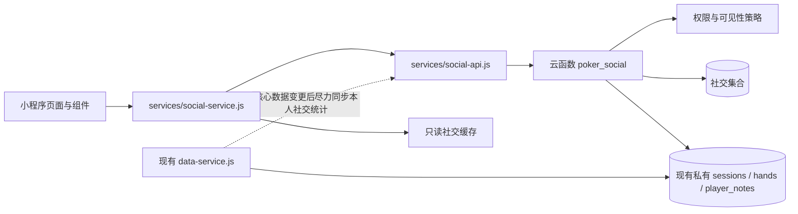
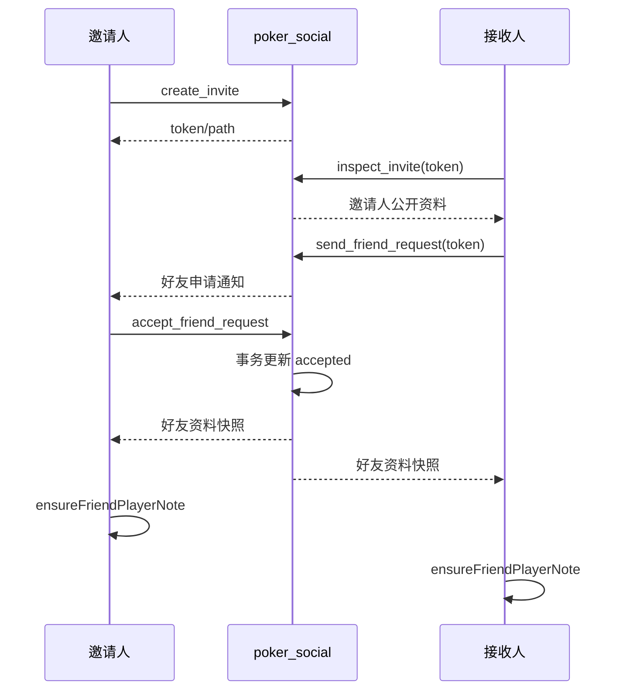

# 好友系统技术设计文档

## 文档状态

- 日期：2026-07-19
- 状态：已确认，进入实施计划
- 需求基线：`docs/superpowers/specs/2026-07-19-friend-system-requirements.md`
- 视觉基线：`web-preview/friend-system-redesign-concept.html`、`friend-hand-share-demo.html`、`friend-feed-demo.html`、`friend-list-message-demo.html`
- 适用项目：`poker-live-miniapp`

## 1. 设计目标

本设计在现有微信小程序、CloudBase 数据与 `data-service` 架构上增加一套独立社交域，完成小程序好友、好友资料、排行榜、脱敏手牌分享、评论点赞、玩家名片分享和消息中心。

设计必须满足以下硬约束：

1. 不读取或推断微信通讯录好友；只建立双向确认的小程序好友。
2. 所有跨账号访问都经过云函数鉴权，客户端不能直接查询社交集合。
3. 好友资料与排行榜的接口不返回任何盈亏、胜率、资金或场次地点字段。
4. 分享手牌由云端读取私有原手牌并生成独立快照，所有金额统一转成 BB，非 Hero 玩家强制匿名。
5. 好友私人备注复用玩家库详情语义，但只属于查看者本人，不回传给好友或其他用户。
6. 社交故障不阻塞场次、记牌、复盘、统计和玩家库原有流程。
7. 第一版对广场文字评论、回复和公开昵称执行服务端自动检测，并实现服务端 OpenID 白名单管理员的评论软删除与操作审计；逐条举报、屏蔽、聊天和微信订阅消息暂不实现。

## 2. 方案比较与结论

### 2.1 方案 A：继续扩展 `poker_data`

优点是部署单一、能够直接读取当前私有数据。缺点是 `poker_data` 已同时承担同步、恢复、统计、玩家库与审计职责；继续加入好友权限、信息流和互动后，任何社交改动都可能影响核心记牌数据。

### 2.2 方案 B：客户端直接访问社交集合

开发量较小，但集合权限难以表达“广场 / 全部好友 / 指定好友 / 已解除好友 / 已撤回”等组合规则，也容易在查询或前端裁剪时泄露 OpenID 和私有字段，因此不采用。

### 2.3 方案 C：独立 `poker_social` 云函数（采用）

新增独立云函数作为社交域唯一入口。私有牌局仍由 `poker_data` 和现有集合管理；`poker_social` 只在发布快照或同步本人统计时，按当前 OpenID 读取该用户自己的私有文档。社交集合禁止客户端直读直写。

此方案增加一个部署单元，但能把社交鉴权、脱敏与核心数据同步隔离，是当前项目风险最低的方案。

## 3. 总体架构



### 3.1 边界

- `data-service`：继续负责本地优先的场次、手牌和玩家库数据。
- `social-service`：负责社交页面用例、分页、只读缓存与错误映射，不保存跨账号权威数据。
- `social-api`：只封装 `wx.cloud.callFunction({ name: 'poker_social' })`。
- `poker_social`：解析微信登录身份、校验权限、生成快照、执行业务事务、返回白名单 DTO。
- 社交集合：只允许云函数服务端访问；客户端数据库安全规则设为拒绝读写。

### 3.2 身份

- 云端使用 `cloud.getWXContext().OPENID` 识别当前调用者。
- `ownerOpenId` 只存于服务端集合，任何响应 DTO、页面参数、分享路径和日志前端字段都不得包含它。
- 首次使用社交功能时生成不可推导 OpenID 的随机 `socialUserId`。
- 现有 `playerId` 继续用于私有业务数据，不作为公开社交 ID。

## 4. 客户端页面与组件

### 4.1 现有页面调整

#### `pages/player-notes/player-notes`

作为“玩家”Tab 的页面壳：

- 一级切换“好友 / 玩家库”。
- 玩家库分支继续使用现有列表、筛选和创建逻辑。
- 好友分支提供“动态 / 好友 / 排行榜”，默认动态。
- 社交数据按分支懒加载；进入玩家库不得等待社交接口。
- 页面右上角显示消息入口与未读数。

#### `pages/player-note-detail/player-note-detail`

继续作为玩家详情的唯一页面，并支持两种进入模式：

- `id=<playerNoteId>`：现有玩家库模式。
- `friendUserId=<socialUserId>`：好友模式。

好友模式先读取当前用户私有的好友玩家记录，再读取云端好友统计。页面复用头像、名称、玩家类型、Leak、Note 和对战手牌区域，并增加称号、累计时长、手牌数和解除好友。私有字段可编辑，云端称号与统计只读。

#### `pages/hand-detail/hand-detail`

增加“发布手牌”入口。入口只传 `handId`，不得在页面端拼装公开快照。

#### `pages/profile/profile`

增加“隐私与分享”：统计可见开关、默认发布范围，以及 BB 化和匿名化不可关闭的说明。

### 4.2 新页面

- `pages/social-hand-publish/social-hand-publish`：预览脱敏结果、选择广场/全部好友/指定好友并确认发布。
- `pages/social-hand-detail/social-hand-detail`：展示分享快照、评论、回复、贴纸和点赞。
- `pages/social-messages/social-messages`：消息列表、好友申请处理和全部已读。
- `pages/social-card-preview/social-card-preview`：预览玩家名片、选择覆盖或新建并导入。
- `pages/social-invite/social-invite`：生成邀请卡片与二维码，处理邀请参数。

### 4.3 好友列表的玩家库复用

好友建立成功后，客户端调用 `ensureFriendPlayerNote(friendSnapshot)` 创建一条当前用户私有的玩家记录：

```js
{
  sourceKind: 'friend',
  linkedFriendUserId: 'su_xxx',
  name: '建立好友时的昵称快照',
  avatarFileId: '', // 只有当前用户主动覆盖头像后才写入自己的文件
  type: '未分类',
  leakTags: [],
  note: '',
  battleHandIds: []
}
```

- `sourceKind: 'friend'` 的记录不显示在“玩家库”分支，只显示在好友分支。
- 未设置本地头像时，页面通过好友关系中的建立时头像快照获取临时展示 URL，不把对方的云文件 ID 写入当前用户玩家记录。
- 当前用户修改头像、名称、类型、Leak、Note 或对战手牌，只更新自己的 `player_notes` 文档。
- 不按同名自动合并，避免覆盖已有玩家库记录。
- 解除好友时将记录转换为 `sourceKind: 'library'`，清除 `linkedFriendUserId`，保留用户已经积累的私有资料和对战手牌。
- 旧数据的 `alias` 字段继续兼容读取，但不参与好友匹配、名片分享或重复检测。

## 5. 云函数模块

`cloudfunctions/poker_social` 按职责拆分，避免单文件继续膨胀：

```text
poker_social/
├─ index.js                 # action 路由与统一响应
├─ package.json
└─ lib/
   ├─ identity.js          # OPENID -> socialUser
   ├─ validation.js        # 输入长度、枚举、频率限制
   ├─ idempotency.js       # clientMutationId 去重
   ├─ friendship.js        # 邀请、申请、关系与冷却
   ├─ visibility.js        # 分享、资料与互动权限
   ├─ hand-snapshot.js     # 私有手牌白名单与 BB 化匿名
   ├─ ranking.js           # 统计同步与排名
   ├─ player-card.js       # 名片快照、有效期与导入凭证
   ├─ interaction.js       # 评论、回复与点赞
   ├─ notification.js      # 消息写入、聚合和已读
   └─ repository.js        # 数据库访问与分页
```

所有 action 返回统一结构：

```js
{ code: 0, data: {}, requestId: 'req_xxx' }
{ code: 'FORBIDDEN', message: '当前无权访问该内容', requestId: 'req_xxx' }
```

客户端只根据稳定 `code` 映射提示，不依赖云函数内部错误文本。

## 6. 数据模型

### 6.1 `social_users`

```js
{
  _id: 'su_random',
  ownerOpenId: 'server-only',
  privatePlayerId: 'server-only',
  profile: {
    nickname: '用户选定的小程序昵称',
    avatarFileId: 'cloud://...',
    avatarText: '老'
  },
  title: '深夜局观察员',
  statsVisible: true,
  defaultShareScope: 'friends',
  status: 'active',
  createdAt: 0,
  updatedAt: 0
}
```

用户首次启用社交资料时，可以明确选择采用微信头像昵称或当前小程序资料。后续修改只更新自己的社交资料；已建立好友一侧的私人备注不会被自动覆盖。

### 6.2 `social_friendships`

```js
{
  _id: 'fr_<canonicalPairHash>',
  userIds: ['su_a', 'su_b'],
  userA: 'su_a',
  userB: 'su_b',
  requesterId: 'su_a',
  receiverId: 'su_b',
  profileSnapshots: {
    su_a: { nickname: '老王', avatarFileId: 'server-only' },
    su_b: { nickname: '赤狐', avatarFileId: 'server-only' }
  },
  status: 'pending', // pending | accepted | rejected | removed
  acceptedAt: 0,
  rejectedAt: 0,
  removedAt: 0,
  cooldownUntil: 0,
  createdAt: 0,
  updatedAt: 0
}
```

两端 ID 排序后生成确定性文档 ID，确保同一用户对只有一条关系。双方同时申请时复用原记录；所有状态变更在数据库事务中完成。

`profileSnapshots` 在建立好友时固化。云函数将头像文件转换为有时效的展示 URL 后再返回；原始 `avatarFileId` 不进入客户端 DTO。当前用户的本地头像覆盖优先于该快照。

### 6.3 `social_invites`

好友邀请码由云函数环境变量 `SOCIAL_INVITE_TOKEN_SECRET`（最少 32 个随机字节）与邀请人、动作、`clientMutationId` 通过 HMAC-SHA256 派生为 22 字符 base64url 代码。数据库只保存其 SHA-256 摘要，不保存可直接使用的明文邀请码或可逆值；密钥缺失或不足 32 字节时创建邀请必须失败关闭。该长度能够直接放入小程序码 `scene`。字段包括邀请人、用途、过期时间、撤销状态和使用次数。打开邀请只获得发起申请的能力，不能直接成为好友。邀请有效期为 7 天。

### 6.4 `social_daily_stats`

```js
{
  _id: 'sd_<socialUserId>_<yyyyMMdd>',
  socialUserId: 'su_xxx',
  dateKey: '20260719',
  durationMinutes: 126,
  recordedHandCount: 34,
  updatedAt: 0
}
```

仅存投入指标，不存利润、买入、带走、胜率或场次地点。累计值由有效日桶聚合；称号从累计投入规则计算并写回 `social_users.title`。

### 6.5 `social_hand_shares`

```js
{
  _id: 'sh_xxx',
  publisherId: 'su_xxx',
  publisherSnapshot: { nickname: '老王', avatarFileId: 'cloud://...', title: '...' },
  source: { ownerOpenId: 'server-only', handId: 'hand_xxx' },
  scope: 'square', // square | friends | selected
  targetUserIds: [],
  snapshotVersion: 1,
  handSnapshot: {},
  likeCount: 0,
  commentCount: 0,
  status: 'active', // active | withdrawn
  createdAt: 0,
  updatedAt: 0,
  withdrawnAt: 0
}
```

`targetUserIds` 只在 `selected` 时非空。`friends` 的读取按当前好友关系实时判断，不固化发布时好友列表，因此解除好友后立即失去访问权。

### 6.6 `social_comments`

```js
{
  _id: 'cm_xxx',
  shareId: 'sh_xxx',
  authorId: 'su_xxx',
  authorSnapshot: { nickname: '赤狐', avatarFileId: 'cloud://...' },
  parentCommentId: '',
  kind: 'text', // text | sticker
  text: '这里转牌可以更小',
  stickerId: '',
  status: 'active', // active | deleted
  createdAt: 0,
  deletedAt: 0
}
```

回复最多一层；若父评论本身已有 `parentCommentId`，服务端拒绝继续嵌套。删除后保留占位与已有回复。

### 6.7 `social_likes`

文档 ID 使用 `lk_<shareId>_<socialUserIdHash>`，保证一人一赞。记录 `active` 状态与时间；点赞计数与状态变更在事务中同步。

### 6.8 `social_player_card_shares`

保存分享者、唯一接收者、五类名片快照、7 天过期时间、撤回状态和导入状态。快照不包含 `alias`、玩家 ID、对战手牌、统计、时间字段或云文件内部元数据。

### 6.9 `social_notifications`

每条消息保存接收者、类型、操作者展示快照、目标类型、目标 ID、聚合数量、已读状态和时间。通知只保存跳转线索，点击时必须重新读取并鉴权目标，不能因通知存在而绕过权限。

### 6.10 `social_mutations`

文档 ID 由当前用户与 `clientMutationId` 生成，保存 action 与结果摘要。所有好友申请处理、发布、评论、点赞、撤回、导入和全部已读写操作都必须携带 `clientMutationId`。

## 7. 核心业务流程

### 7.1 建立好友



拒绝或解除后写入 `cooldownUntil = now + 7 days`。接受、拒绝和解除都根据当前状态幂等返回。

`create_invite_qr` 的幂等对象是稳定的邀请代码、邀请摘要和 `cloudPath`；小程序码生成与云文件上传在数据库事务提交后执行。`qrCodeUrl` 是每次调用都可重新签发的临时展示 URL，不承诺重试后字面相同。

### 7.2 同步社交统计

1. 场次或手牌云端写入成功后，`data-service` 后台调用 `sync_my_social_stats`；失败只记录日志，不回滚核心写入。
2. 用户进入好友主页或排行榜时再次触发一次节流同步，同一账号 5 分钟内最多执行一次。
3. 云函数只读取当前 OpenID 所属的 `sessions` 和 `hands`。
4. 只统计已结束、时长为正的场次；进行中和无法解析时长的场次忽略。
5. 按北京时间生成日桶，并更新累计称号。
6. 排行榜读取当前用户与有效好友的日桶，剔除 `statsVisible=false` 的用户。

本周使用北京时间周一 00:00 边界，本月使用自然月边界。排序键仅为 `durationMinutes DESC`；相同时使用并列名次，稳定展示顺序再按 `socialUserId` 排列，但不改变名次。接口返回 Top 10；本人未进入 Top 10 时额外返回 `myRank`。

### 7.3 发布手牌

客户端只提交：

```js
{
  action: 'publish_hand',
  handId: 'hand_xxx',
  scope: 'square',
  targetUserIds: [],
  clientMutationId: 'publish_hand_uuid'
}
```

云端流程：

1. 使用当前 OpenID 和当前账号 `playerId` 读取原手牌、行动与所属场次。
2. 校验手牌归属和大盲值；无法可靠确定 BB 时返回 `BLIND_REQUIRED`。
3. 从允许字段白名单构造新对象，不对原文档做“删除几个敏感字段”式脱敏。
4. 所有筹码值除以大盲值，最多保留两位小数并去除无意义尾零。
5. Hero 统一为 `Hero`；其他座位按稳定座位顺序分配夜鸦、赤狐、黑猫、银狼、幻蝶、灰隼、绯蛇、白鲸。
6. 只保留原记录明确标记为摊牌的对手底牌。
7. 校验范围：广场无需好友目标；全部好友要求至少有一个有效好友；指定范围要求 1 至 50 位当前有效好友。
8. 写入独立快照和相应通知。

发布后编辑原手牌不更新快照。删除原手牌时，`data-service` 在原删除成功后尽力调用 `withdraw_shares_by_source_hand`；社交详情读取时也会核验源手牌存在性并自动失效漏掉的分享。

### 7.4 分享可见性

服务端统一使用以下策略，不允许各 action 自己拼条件：

```js
function canReadShare(viewerId, share, friendship) {
  if (share.status !== 'active') return false
  if (viewerId === share.publisherId) return true
  if (share.scope === 'square') return true
  if (!friendship || friendship.status !== 'accepted') return false
  if (share.scope === 'friends') return true
  return share.targetUserIds.includes(viewerId)
}
```

评论、回复和点赞在写入前再次调用同一策略。修改范围、解除好友或撤回后，下一次请求立即按新状态判断。

### 7.5 评论与点赞

- 文本去除首尾空白后必须为 1 至 300 字符；Emoji 按普通 Unicode 文本保存。
- 贴纸只接受应用内 `POKER_STICKER_IDS` 白名单中的 ID，不能携带 URL。
- 评论作者可以软删除自己的评论；发布者无权删除他人评论。
- 点赞使用确定性 ID 和事务更新计数，重复请求不重复计数。
- 动态卡片只显示约 16px 的点赞、评论图标，点击热区不小于 36px。

### 7.6 玩家名片

1. 分享者从一张本人玩家记录生成五字段白名单快照。
2. 一次只接受一个有效好友 `targetUserId`。
3. 接收方打开时重新校验好友关系、撤回状态和 7 天有效期。
4. 导入前在客户端按标准化名称提示疑似重复。
5. 新建：调用现有 `createPlayerNote(snapshot)`。
6. 覆盖：调用现有 `updatePlayerNote(existingId, fiveFieldPatch)`；不传 `_id`、`battleHandIds`、`linkedHandIds`、`createdAt` 等字段。
7. 云端用导入 mutation 标记已导入；重复提交返回同一结果，不重复新建。

导入是跨两个服务的操作，采用“客户端本地/玩家库写入成功后，再确认云端已导入”的顺序。如果最后一步失败，下次打开消息时按 `clientMutationId` 补确认；已经创建的玩家记录不再创建第二份。

### 7.7 消息中心

- 默认每页 20 条，使用 `(createdAt, _id)` 游标，不使用不断增大的 `skip`。
- “全部已读”按接收者批量更新，重复操作幂等。
- 点赞通知在同一手牌 10 分钟窗口内聚合；评论和回复不聚合。
- 消息入口未读数字最大显示 `99+`，底部玩家 Tab 只显示红点。
- 点击消息后目标不存在、过期、撤回或失权时展示“内容已不可访问”。

## 8. 缓存、在线和错误处理

### 8.1 缓存

- 动态、好友列表、排行榜和消息各使用独立缓存键。
- 成功响应缓存 5 分钟；分页只缓存第一页。
- 网络错误时可以展示最后一次成功缓存并标记“离线内容”，所有写按钮禁用。
- 权限拒绝、解除好友、撤回或删除响应立即清除相关缓存。
- 缓存不作为鉴权依据，不缓存 OpenID、源手牌 ID或玩家名片内部字段。

### 8.2 稳定错误码

| 错误码 | 页面行为 |
|---|---|
| `LOGIN_REQUIRED` | 提示重新进入或登录 |
| `SOCIAL_PROFILE_REQUIRED` | 引导初始化社交头像昵称 |
| `FRIENDSHIP_REQUIRED` | 提示已不是好友并返回列表 |
| `FRIEND_REQUEST_COOLDOWN` | 显示可再次申请日期 |
| `FORBIDDEN` | 显示无权访问，不泄露目标是否存在 |
| `CONTENT_UNAVAILABLE` | 展示内容已不可访问 |
| `BLIND_REQUIRED` | 引导补全手牌盲注后再发布 |
| `INVALID_SHARE_SCOPE` | 保留发布表单并提示重选范围 |
| `COMMENT_TOO_LONG` | 保留输入内容并显示 300 字限制 |
| `RATE_LIMITED` | 提示稍后再试 |
| `NETWORK_ERROR` | 展示只读缓存或统一不可用状态 |

### 8.3 基础频率限制

第一版不做内容审核，但服务端执行基础防滥用：

- 好友申请：每账号每天最多 20 次，且受 7 天关系冷却约束。
- 发布手牌：每账号每小时最多 20 条。
- 评论/回复：每账号每分钟最多 10 条。
- 点赞状态切换：每账号每分钟最多 30 次。
- 玩家名片分享：每账号每天最多 20 次。

阈值集中定义于 `validation.js`，超过限制统一返回 `RATE_LIMITED`。

## 9. 安全与隐私

### 9.1 响应白名单

每个 action 必须显式构造 DTO，禁止把数据库文档直接 `return`。CI/测试应扫描社交响应夹具，确保不出现以下字段：

```text
ownerOpenId, _openid, profit, currentProfit, buyIn, cashOut,
hourlyRate, winRate, venue, sessionId, sourceHandId,
playerNoteId, leakTags, note, battleHandIds
```

其中 `leakTags` 和 `note` 仅允许出现在受限玩家名片 DTO 中，不能出现在好友统计或手牌分享 DTO 中。

数据库内部的 `avatarFileId` 也不直接返回；所有社交 DTO 只返回云函数生成的 `avatarUrl`。客户端本地上传的头像仍按现有玩家库流程保存到当前用户自己的 `player_notes`。

### 9.2 邀请令牌与名片访问凭证

- 好友邀请码使用至少 32 个随机字节的云函数环境变量密钥，通过 HMAC-SHA256 派生为 22 字符 base64url；路径或小程序码 `scene` 只携带派生后的明文邀请码。
- 数据库仅保存摘要，密钥不进入小程序包、仓库或客户端响应；密钥缺失或不足 32 字节时创建邀请失败关闭。
- 好友邀请令牌 7 天有效；玩家名片访问凭证与唯一接收人和 7 天有效期绑定。
- 第一版玩家名片只通过站内消息送达指定接收人；若未来增加微信系统分享卡片，仍必须复用相同的接收人鉴权。

### 9.3 清除账号数据

清除流程先调用 `clear_my_social_data`：撤回分享和未导入名片、解除好友、隐藏统计并将社交用户状态改为 `deleted`；然后执行现有私有数据清理。若社交清理失败，页面必须明确提示并允许重试，不能声称全部清除完成。

## 10. 并发与一致性

- 好友申请接受/拒绝/解除使用事务和状态前置条件。
- 赞数、评论数与明细写入同一事务；列表显示计数允许由后台校准任务修复。
- 所有 mutation 使用 `clientMutationId`，保存最近结果避免网络重试重复写入。
- 发布范围变更先更新主分享，再使相关缓存失效；读取永远以主分享当前状态为准。
- 名片导入保留接收方玩家 ID和对战手牌字段，五个覆盖字段以单次 `updatePlayerNote` 原子更新。
- 社交统计是最终一致的展示数据，允许最长 5 分钟延迟；核心牌局记录始终是权威来源。

## 11. 性能与分页

- 动态、好友、消息和评论默认每页 20 条。
- 排行榜只返回 Top 10 与可选 `myRank`，不返回全量好友排名。
- 指定好友发布最多选择 50 人，避免文档和权限判断无限增长。
- 动态按 `status + createdAt` 建索引；评论按 `shareId + status + createdAt` 建索引；通知按 `recipientId + read + createdAt` 建索引；日统计按 `socialUserId + dateKey` 建索引；好友关系必须分别建立与查询排序完全匹配的复合索引：`(userA ASC, status ASC, acceptedAt DESC, _id ASC)` 和 `(userB ASC, status ASC, acceptedAt DESC, _id ASC)`。部署到测试环境时必须验证两条 `list_friends` 定向查询命中对应索引。
- 好友列表不逐条请求统计；`list_friends` 服务端批量装配公开资料和允许的统计摘要。

## 12. 测试设计

### 12.1 单元测试

- canonical 好友对 ID、7 天冷却与双向重复申请。
- BB 换算、两位小数、缺失盲注拒绝、稳定匿名代号。
- 分享快照字段白名单，验证所有禁止字段均不存在。
- 三种范围在好友建立、解除、重新建立后的权限矩阵。
- 评论一层回复、删除占位、贴纸白名单与 300 字限制。
- 点赞和所有 mutation 的幂等性。
- 同名名片新建/覆盖及对战手牌关联保留。
- 北京时间周/月边界、并列排名、Top 10 和榜外本人。

### 12.2 云函数集成测试

- 使用两个非好友账号、两个好友账号和一个解除关系账号覆盖跨账号读取。
- 验证客户端伪造 `publisherId`、`targetUserIds`、源手牌快照和 OpenID 均无效。
- 验证广场允许任意已登录账号互动，好友与指定范围严格限制。
- 验证撤回、过期、删除原手牌和清除账号数据后所有入口失效。
- 验证社交云函数失败不回滚核心场次和手牌写入。

### 12.3 页面测试

- 玩家 Tab 在好友和玩家库间切换时，玩家库原有筛选、创建和详情不回归。
- 好友详情私有字段可编辑，云端统计只读且隐藏状态正确。
- 发布页的广场二次确认、全部好友默认值和指定好友校验。
- 动态点赞/评论使用小图标和至少 36px 热区。
- 排行榜前三名动效在 `prefers-reduced-motion` 下关闭；第 4 至 10 名仍保持清晰层级。
- 消息接受/拒绝、全部已读、名片预览导入和失效内容状态。

### 12.4 发布前人工检查

1. 两个真实微信账号完成邀请、接受、查看资料和解除闭环。
2. 广场、全部好友和指定好友各发布一手并用第三账号验证权限。
3. 对抓包响应搜索 OpenID、盈亏、场次、玩家库 Note 等敏感字段。
4. 在断网和云函数异常时确认核心记牌仍可使用。
5. 正式发布前重新核对微信平台对公开社区内容审核、举报和治理的要求；若平台要求，则把相应能力提升为发布前置条件。
6. 使用非管理员账号伪造管理员删除动作，确认云端拒绝且评论、计数和审计记录都不变化。
7. 使用管理员账号删除一条其他用户评论，确认详情、分页重载和旧链接都只显示“该评论已被管理员移除”。

## 13. 交付顺序

### 里程碑一：关系与资料

1. 社交身份、邀请、申请、接受、拒绝、解除和冷却。
2. 玩家 Tab 信息架构、好友列表和复用玩家详情。
3. 私有好友玩家记录与解除后的玩家库保留。
4. 统计同步、Top 10 排行榜和隐私开关。
5. 玩家名片分享、预览、覆盖/新建导入。
6. 消息中心基础类型和未读状态。

### 里程碑二：手牌互动

1. 云端 BB 化匿名快照生成器。
2. 广场、全部好友、指定好友发布与统一动态。
3. 手详情、文字/Emoji/扑克贴纸、一层回复。
4. 点赞、撤回、源手牌删除联动和消息聚合。
5. 权限矩阵、安全扫描、真实账号联调与性能校验。

两个里程碑只作为内部开发与验收边界；全部通过后一次性发布。

## 14. 可拓展功能的架构预留

第一版不实现，但当前边界允许后续独立增加：

- 更广范围的自动内容检测、逐条举报、完整审核工作台与申诉：广场文字评论和公开昵称已在写入前同步检测；后续能力沿用同一云端鉴权边界，不改变分享快照模型。管理员紧急删除评论已经属于第一版能力。
- 用户屏蔽与评论本地隐藏：在 `visibility.js` 增加关系策略，不修改私有手牌。
- 微信订阅消息：消费 `social_notifications`，不改变站内消息权威状态。
- 好友分组：把 `friends` 范围扩展为组 ID策略，不修改现有 `selected` 语义。
- 广场热门、话题和搜索：基于公开分享建立独立索引，不开放私有集合。
- 玩家名片协作更新：新增版本与接受更新流程，不远程覆盖已导入副本。
- 玩家名片微信系统分享卡片：仍复用指定接收人鉴权和七天有效期，但需另行设计无权限用户收到转发卡片时的解释与引导，不作为第一版私密送达链路。

这些功能均不应通过提前添加空字段或不可验收的占位逻辑进入第一版。

## 15. 验收结论条件

只有同时满足以下条件，好友系统才可以进入发布候选：

1. 所有社交集合拒绝客户端直读直写。
2. 权限矩阵和敏感字段白名单测试全部通过。
3. 玩家库原功能回归测试通过，好友私有编辑不会污染对方数据。
4. 三种手牌范围、BB 化与匿名化通过真实数据验证。
5. Top 10、榜外本人、统计隐藏和并列名次正确。
6. 玩家名片新建/覆盖都不会删除已有对战手牌。
7. 撤回、解除、过期和清除数据后权限立即失效。
8. 管理员评论软删除由云端 OpenID 白名单鉴权，普通用户无法伪造，删除后评论计数与审计记录一致。
9. 社交接口故障时核心记牌流程仍可完成。
10. 公开广场上线前的微信平台合规复核完成。
