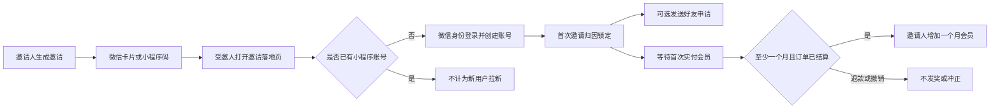

# 新用户邀请归因与会员奖励需求设计

## 1. 目标

在现有“好友邀请”之外建立独立的拉新邀请管理能力，为未来会员收费做准备：老用户邀请从未注册过小程序的新用户，新用户完成首次注册并首次实付至少一个月会员后，邀请人获得一个月会员时长。

好友关系与奖励归因必须解耦。发送、接受或解除好友关系均不得创建、转移或取消拉新归因。

## 2. 核心流程

## 3. 第一归因规则

- “新用户”以微信账号对应的核心小程序账号是否首次创建为准，不能只看是否首次建立社交资料。
- 第一个促成新用户完成注册的有效邀请永久获得归因；后续打开其他邀请码不得覆盖。
- 同一邀请人与同一受邀人最多形成一条归因记录。
- 自己邀请自己、注册前已有核心账号、测试账号、管理员补录账号均不计入有效拉新。
- 邀请码过期仅阻止新的注册归因，不影响已经锁定的归因和后续付费奖励。
- 好友申请是否发送、接受、拒绝或解除，不影响拉新归因。

## 4. 奖励规则

- 触发条件：受邀人首次购买的有效会员订单覆盖至少一个自然月，并已支付成功。
- 正式接入支付时应在退款观察期结束后发放；不能由客户端“支付成功”页面直接发奖。
- 奖励：邀请人会员到期时间顺延一个月；终身会员或不适用账号进入人工处理状态。
- 每条归因最多成功发奖一次，支付回调、消息重试和人工补发必须幂等。
- 全额退款时未发放的奖励取消；已经发放时生成冲正记录，不能直接改写原奖励流水。
- 首期建议设置每个邀请人每年最多获得 12 个月奖励，超出部分进入待审核，降低刷号风险。

## 5. 邀请管理页面

入口放在“好友邀请”页面，不占用底部 Tab。页面展示：

- 汇总：累计邀请、已注册、待付费、已奖励、累计奖励月数。
- 明细状态：已打开（可选）、已注册、待付费、支付确认中、已奖励、已失效、待审核。
- 规则说明：奖励条件、预计到账时间、退款处理、年度上限。
- 隐私：邀请人只能看到受邀人的公开昵称/头像和状态，不显示订单金额、OpenID、手机号或支付单号。

## 6. 数据模型建议

### referral_attributions

- `inviteeAccountId`：唯一索引，保证第一归因不可覆盖。
- `inviterAccountId`、`inviteId`、`registeredAt`。
- `status`：`registered | awaiting_payment | payment_pending | rewarded | reversed | review_required`。
- `qualifyingOrderIdHash`：只存不可逆摘要或内部安全引用。
- `rewardLedgerId`、`rewardedAt`、`reversedAt`。

### membership_reward_ledger

- `idempotencyKey`：建议为 `referral_reward:<attributionId>`，唯一。
- `beneficiaryAccountId`、`months`、`sourceAttributionId`。
- `operation`：`grant | reverse`。
- `createdAt`、`effectiveAt`、`operator`。

客户端禁止直接读写两张表，统一由会员/支付云函数输出白名单 DTO。

## 7. 分阶段交付

### 当前好友阶段

- 小程序码和微信分享卡片使用同一个邀请 token。
- 新用户在邀请落地页完成微信登录、社交资料初始化，再继续发送好友申请。
- 邀请 token 在登录过程中不丢失。

### 会员基础设施阶段

- 创建不可覆盖的归因表、邀请管理查询接口与管理页面。
- 核心账号首次创建事务内锁定邀请归因，不能由“好友申请成功”代替注册归因。

### 正式收费阶段

- 支付服务端事件校验首单、会员周期、退款状态和风控结果。
- 写入会员奖励账本并幂等延长邀请人会员。
- 增加退款冲正、人工审核和年度奖励上限。

## 8. 验收标准

- 新用户从二维码或微信卡片进入，登录后仍停留在同一邀请流程并能发送申请。
- 已有账号打开邀请不会被认定为新用户，也不会覆盖历史归因。
- 同一新用户先后打开两个邀请，只有首次完成注册的邀请人获得归因。
- 好友关系解除后，归因和有效奖励仍保留。
- 重复支付回调只能产生一条奖励流水。
- 不满足一个月、未支付、全额退款和测试订单不能产生正式奖励。
- 邀请管理接口不返回订单金额、OpenID、支付单号及其他私有字段。
